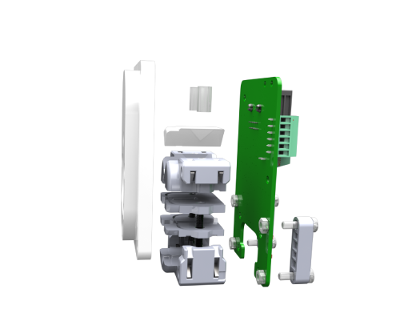

# CAD Files #

Please see below a generic description of the files in this directory:

## Acrylic Parts ##

|File name | Description|
|-|-|
|Acrylic_Plates_Lickometer_5mm_v1.pdf | 5mm acrylic part (white)|
|Acrylic_Plates_Panel_Mount_Example_5mm_v1.pdf | 5mm acrylic part (white)|

## 3D Printed Parts ##

|File name | Description|
|-|-|
|Lickometer_Dual_Detection_Optical_Fiber-1.stl | Poke 3D|
|Lickometer_Dual_Detection_Optical_Fiber-2.stl | Poke 3D|
|Lickometer_Dual_Detection_Optical_Fiber-3.stl | Poke 3D|
|Lickometer_Dual_Detection_Optical_Fiber-4_M.stl | Poke 3D - for males|
|Lickometer_Dual_Detection_Optical_Fiber-4_F.stl | Poke 3D - for females|
|Lickometer_Dual_Detection_Optical_Fiber-5.stl | Poke 3D|
|Lickometer_Dual_Detection_Optical_Fiber-6.stl | (optional) Spout friction controller|
|Lickometer_Dual_Detection_Optical_Fiber_LED_Holder.stl | LEDs holder| 
|Lickometer_Dual_Detection_Optical_Fiber_Photo_Holder.stl | Photosensors holder|

## Assembly Instructions ##

|File name | Description|
|-|-|
|Assembly_instructions.pdf | Lickometer assembly guide|

## Bill of Materials ##

|File name | Description|
|-|-|
|Lickometer_BOM.xlsx | Lickometer list of materials|
 
## 3D Model ##

|File name | Description|
|-|-|
|Lickometer_model_v1.easm | 3D CAD Model|

To visualize the 3D model of the lickometer (and correspondent exploded view) you can download the eDrawings viewer here: https://www.edrawingsviewer.com/download-edrawings and open the 3D model above.

